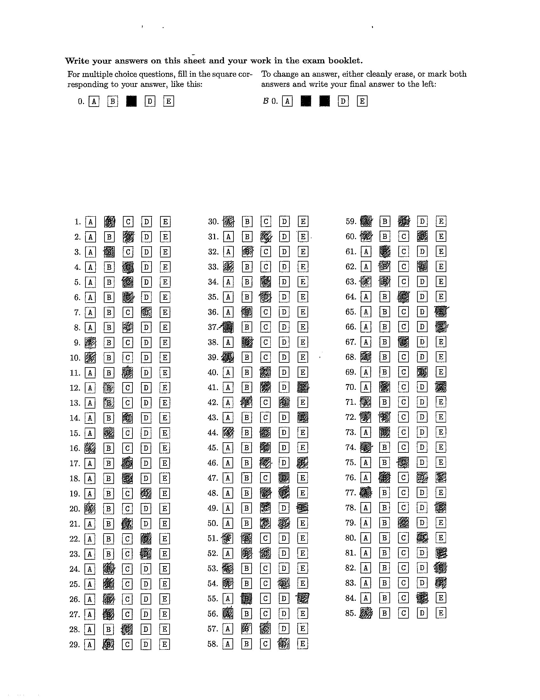
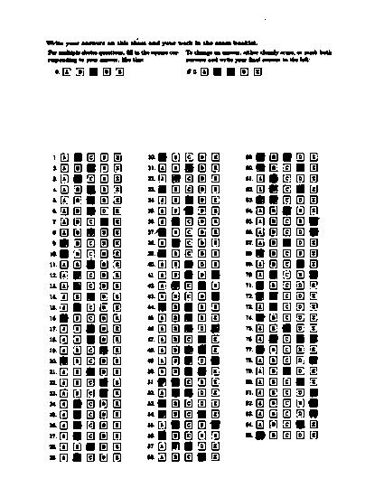
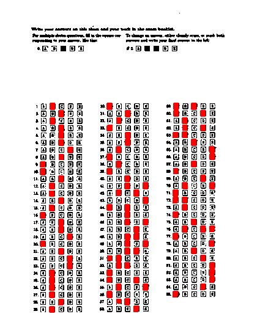
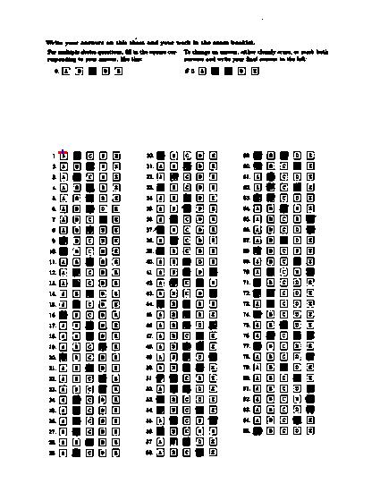
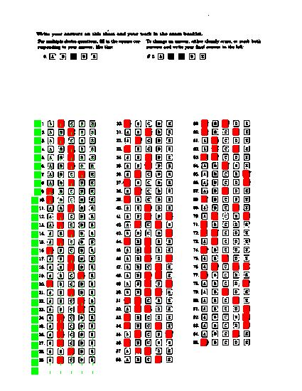

# Grade.py Procedure - Technique One 
## Steps taken:
- Canny edge detection
- Houghline transform 
- Form extraction
- Image binarisation (converting image to binary for easier computation)
- Answer region extraction
- Saving answers to a txt file

# Edge Detection
-   Use my own implementation of canny algorithm to detect edges
-   Used pillow's laplacian filter to detect edges

## Canny edge detection 
- Five steps that I have used to generate canny edges:
    - Image Smoothing ( Gaussian blur )
    - Calculating image gradients in X and Y direction (gaussian derivative)
    - Non Maximum supression
    - Applying thresholds (low and high)
    - Hysterisis

### Image smoothing

**Gaussian Kernel**
-  Calculated using the formula: 1/(2 x np.pi x sigma^2) (e^(-(x^2+y^2)/2 x sigma^2)). But using this kernel resulted in poor blurring results. So, I dediced to switch to scipy.signal.gaussian(). 
- I generate a gaussian kernel with the shape m x 1 and another gaussian kernel of shape nx1. Here, k center values are distributed in form of a gaussian distribution. 
- Then I take outer join of both matrices to generate an mxn matrix. 

**Multiplication of FFTs and IFFT**
- Converted to image and gaussian kernel into their fft forms using scipy's fftpack.fft2() method and then multiplied those two ffts.
- Applied IFFT to the multiplication result using scipy's fftpack.ifft2()
- For gaussian kernel, I had to do ifftshift instead of fftshift because the values were already centered in the kernel and fftshift tries to push the origin to center. Using ifftshift, I shift the origin toward top left for gaussian kernel. 
Reference for ifftshift on gaussian kernel:  https://stackoverflow.com/questions/51200852/frequency-domain-filtering-with-scipy-fftpack-ifft2-does-not-give-the-desired-r

### Gradient Calculation
- Tried using fft to calculate gradients but I made a mistake in generating the mxn kernel matrix and it was too time consuming to debug that. It was inspired from this idea  :https://dsp.stackexchange.com/questions/2830/can-edge-detection-be-done-in-the-frequency-domain
- Switched to scipy's ndimage.convolve() to convolve sobel's approximation of gaussian derivative. This resulted in good x and y image derivatives. Used dx and dy to calculate image gradient magnitude using np.hypot() which calculates hypoteneus (sqrt(x^2 + y^2)) and np.arctan2() to calculate gradient angle.

### Non Maximum Supression
- For each pixel, I look at 8 gradient angles. 
- For each of these angles, I collect the pixel values and finally I take the maximum of these values.
- This supresses all the non-maximal values in our edge map.

### Thresholding
- Using thresholding, we can determine strong and weak edges in an image. 
- I keep an high threshold and all values above that value would be considered as edges.
- I also keep a low threshold. All values below this low threshold can be ignored. 
- Values between high and low threshold are considered as weak edges.

### Hysterisis 
- Using hysteris, I expand the edges by connecting weak edges with existing strong ones.
- If any pixel from weak edge in the image has a strong edge pixel in either of the 8 neighbours, then we can just make that pixel a strong edge.

# Hough line transform
- Gathered hough lines in for angles in range (-90 to 90). 
- Found peaks for hough lines 
- Gathered horizontal and vertical lines

## Hough lines collection
- For thetas in range -90 to 90, I collect values of rhos and thetas.
- Rho is the perpendicular distance from origin to a line. 
- Rho is the anti-clockwise angle of the line with respect to horizontal axis

## Hough peak extraction
- For extracting hough peaks, we take argmax on accumulator for a particular theta index and then try to supress the neighbourhood values.
- I collect the maximum value indices and also highlight the values of peaks in accumulator array.
## Horizontal and vertical line collection
- After collecting the hough peaks, I try to extract horizontal and vertical lines.
- I have used a multiplying factor of 1000, but I could have easily used image.shape(). This is just to make sure that the lines would be visible on the screen. For horizontal lines, I only care about y0 and for vertical lines, I only care about x0. Because those are the values I will use for bounds on my boxes for form detection.

# Region extraction (Form detection)
- Extracted 3 boxes for form using
- Extracted answer boxes by taking proportions with respect to box width and box height

## Form box extraction
- Started from the end of the page and collected vertical houghlines that were at a distance defined by some threshold (<=25).
- This gave me many boxes and I choose 3 biggest boxes and those were my form boxes.
- There was an issue with some images where I had boxes starting from question numbers for those boxes. To handle that case, I again ran a for loop and starting from the end of each box, collected lines that were at a distance less than certain threshold (<15). If they were at a distance >=15, I removed the earlier line (i-1) if comparing between i and i-1. This gave me clean boxes for each images.

## Answer box extraction
- I divide the box into 5 equal parts horizontally to obtain partitions for x values and then use np.linspace to create 30 equally spaced intervals for y values. I choose different method for x values because linspace gave me poor results and we don't necessarily need eqally spaced blocks, just 5 blocks with equal width in one row.

## Answer detection
- Converted answer region to inverse binary so that filled regions correspond to white
- Used np.countnonzero() to count the number of white pixels
- Used a threshold of >=520 to separate filled regions from non filled ones
- **Note:** The threshold is purposefully a bit higher and it misses one case in c-33, but I had to use this in order to avoid wrong detections in some test files where boxes start from question numbers.

## Outside answer detection
- For box 0, I select a region that is between 0 and x of first box (for tuple (x,y,w,h)). Y values were obtained using linspace as described earlier in answer box extraction section.
- For box 1 and 2, I choose a region between x of end of box i-1 and x of start of box i and do the same process as box 0 for y values.
- I again use a threshold, this time of >=350 to detect if something is written in that section or not.

## Some interesting experiments and findings

**Page Rotation Invariance**
- I spent some time trying to make my solution robust to page rotations. So, I padded the image with a 20x20 padding and ran canny edge detection and hough line detection to find the 4 largest hough lines which would correspond to page outlines.
- I was able to extract page angle from that and rotate the images using theta of the first line.
- This unfortunately does not work for our case because, we need form orientation instead of page orientation so, I had to rollback to my previous working version.

**Canny edge detection parameters**
- I decided to tweak maximum threshold for canny to see how my results would vary based on different values of max threshold. And unsurprisingly, for low values of threshold, I was able to gather more edges and for high values, lines were spread out. For my usecase, value of 30 worked the best and I was able to run my algorithm on all test sheets.

## Some environment setup guidelines that I followed
- I created a new conda environment for CV with it's environment.yml file.
- I included all packages necessary for my algorithms in this file and I create and update the environment based on the following commands

### Creating conda env
-  conda env create --file=environment.yml

### Update conda env
- conda env update --name="name of env" --file=environment.yml

## Grade.py Procedure - Technique Two 
### Code in grade-v2.py 

**Steps Taken:**

1. Gaussian Blur + downsampling to 425 x 550 from 1700 x 2200 was applied to image for the sake of
faster processing and purer, richer filled in regions. 

2. K Means Clustering with k = 2 was used to segment entire image into two regions. These two regions were then
colored pure black and pure white, reducing the image to two intensities only

3. Intensity based pseudo-convolution algorithm was used to color every black filled-in answer RED based on patch-based linear scans.
I then use a corner detection heuristic to find the 
start point of the actual answers and conduct a 
similar color based pseudo convolution to find margin answers and translate the “red” regions into the text based answer 
they represent

###Original

### Gaussian + Subsampling + K-Means

###Black Region Detection Algorithm

###Corner Detection Algorithm 

###Answer Detection Algorithm 
####Green Square = Area searched for margin answers
####Top of Green Tick = Areas searched for red intensity

####Detected Answers in Column 1
1: ['B'],
 2: ['C'],
 3: ['B'],
 4: ['C'],
 5: ['C'],
 6: ['C'],
 7: ['D'],
 8: ['C'],
 9: ['A'],
 10: ['A'],
 11: ['C'],
 12: ['B'],
 13: ['B'],
 14: ['C'],
 15: ['B'],
 16: ['A'],
 17: ['C'],
 18: ['C'],
 19: ['D'],
 20: ['A'],
 21: ['C'],
 22: ['D'],
 23: ['D'],
 24: ['B'],
 25: ['B'],
 26: ['B'],
 27: ['B'],
 28: ['C'],
 29: ['B'],

*Note that this technique was only implemented for column one as proof of concept for the technique 

# Part 2: inject.py and extract.py 

The inject.py file has the target of accepting the blank form as input and accepting the solutions file as the input. The file thus produces a barcode that is embedded in the image that is a parameter to the inject.py. The extract.py on the other hand first detects the postion of the barcode, then it goes on ahead to decode the barcode as well.
This is thus he optimal way to imeplement the both injection and extraction of the barcodes from the files.

## Experiments

1. Experimentation on type of barcode encoding to be used: Tests were performed to reduce the encoding length of the string that is generated as a result of the encoding. The final encoding strategy that was used is described in the image above. This ebnables us to have a static lenth of the barcode and thus the length of the strategy implementation.
2. Experimentation on the size of the barcode: (height) The program is robust and thus has the capability to take the averaging of the different rows in the barcode. This provides us with more reliable data that just using the data that is from the first line in the barcode.
3. Position of the barcode: The is now able to adapt based on the position of the barcode and can easily be able to adapt itself with the data. 

## Results
I have attached 3 sheet with varying barcode sizes. The Thicker lines in the barcode provides us with more optimal barcode decoding. The inject.py and the decode.py have been designed with the thickness of the lines to be minimum.

The barcode that is designed without using any scaling.

The barcode that is deisgned using x2 scaling for more reliability in the measurements and recording.

The barcode that is deisgned using x3 scaling for more reliability in the measurements and recording.

This scaling is thus the maximum scaling that can be done in order to detect the barcode. The higher scaling  may result in the barcode being extended out of the page.

## How to run code

To run the inject.py we use

python .\inject.py .\test-images\blank_form.jpg .\test-images\a-3_groundtruth.txt injected3.jpg

To run the extract.py we use

python .\extract.py injected2.jpg decoded.txt

## Design Decisions

1. Encoding:

Initially I had used other encoding strategy to implement the barcode. The barcode encoding strategy that I previously used had the variable length of the barcode, thus resulting in a barcode that was difficult to parse and thus, the barcode when all the options are ABCDE. This would result in a very long string resukting in the encoder to fail encoding for the given width of the page.

The new stratedy where the encoding was done using the postion information provies  a more effective encoding.

2. The bounding bars:

The algorithm has created a boundary for the barcode

3. Location of the barcode:

The algorthm design is capable of finding the position of the barcode based on the relative postion of the pixel intensity map that spikes based on the increase in the the increase in pixel intensity sum of that row in the image.

## Discussion on the Accuracy

The program designed has almost 100% accuracy when the same image is fed. But in real world senario the image that would be fed would be an iamge which would be printed and then later on scanned. Thsu would introduce a lot of noise in the image. This noise will create a deviation in the data that is recorded and the data that is available later on.

## Assumptions

The image is not a high noise image.
The barcode at the top left is not cut and can be acessible.
The image directories for the input image is proper and the data is readily available.

## Approach- Advantages and Disadvantages

Advantages:

1. Fast computation: The barcode encoding and decoding is a very fast process. 
2. Efficeient barcode encoding: The program uses efficent encoding strategy to reduce the size of the barcode
3. Answers can be easily input into the sheet without any extra effort.

Disadvantages:

1. The noise may cause the algorithm to fail efficent decoding.
2. The data that is generated has a high dependency on the orientation of the barcode.